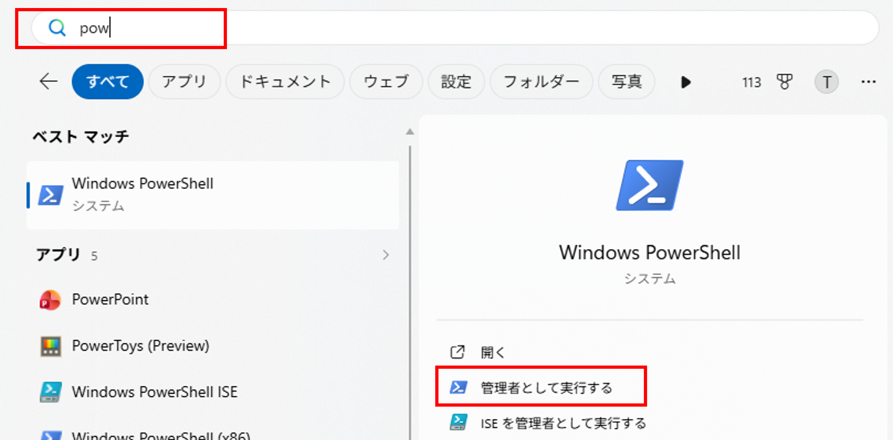
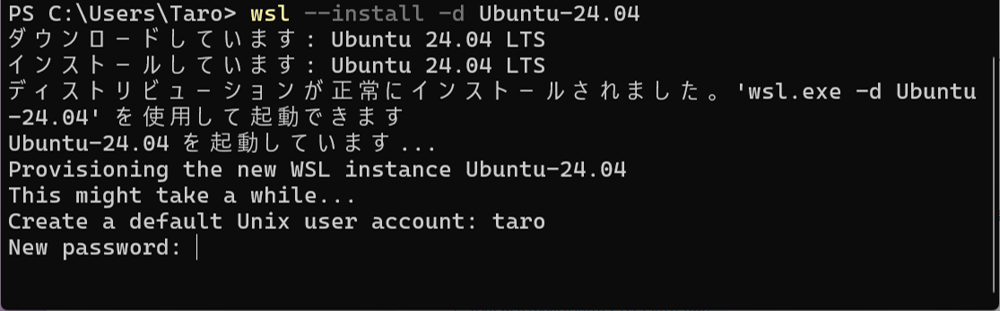
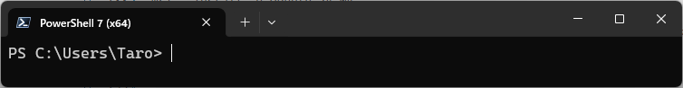
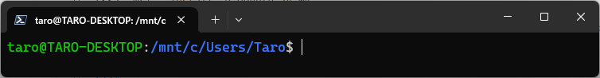
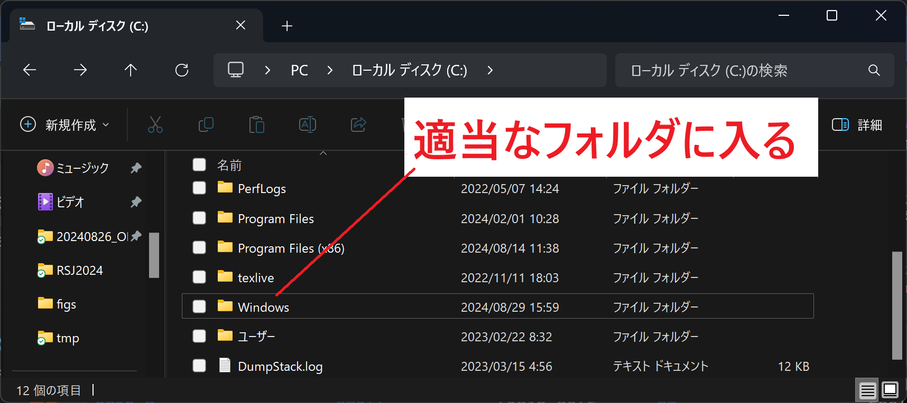
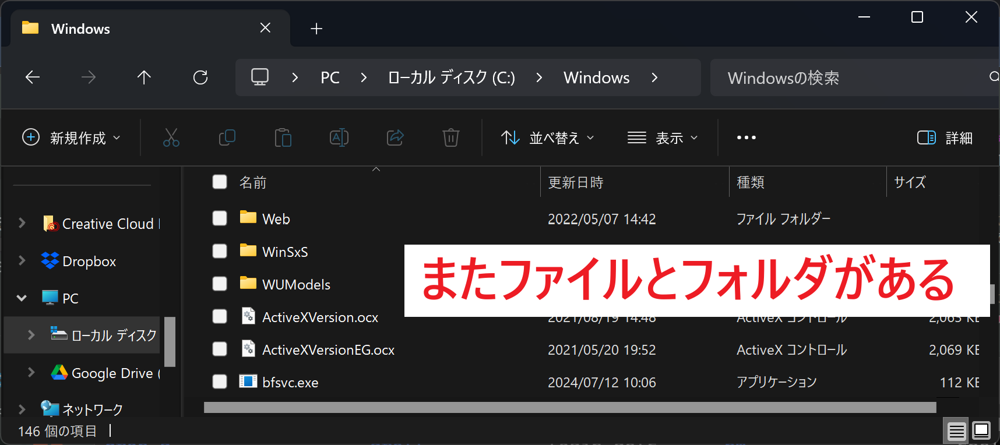
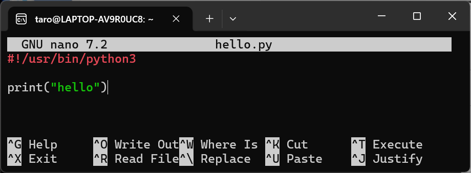

<!-- footer: "ロボットシステム学第1回" -->

# ロボットシステム学

## 第1回: イントロダクション

鈴木 太郎（千葉工業大学）

<span style="font-size:70%">オリジナル: 上田 隆一（千葉工業大学）[ロボットシステム学 2025](https://github.com/ryuichiueda/slides_marp/tree/master/robosys2025) を改変</span>

<br />

<span style="font-size:70%">This work is licensed under a </span>[<span style="font-size:70%">Creative Commons Attribution-ShareAlike 4.0 International License</span>](https://creativecommons.org/licenses/by-sa/4.0/).


---

<!-- paginate: true -->

## 今日の内容

- 講義の目的と内容の理解
- Linux環境の準備
- Linux環境を触る

---

## 本講義の目的

- 最終目標
    - ROS (Robot Operating System) を使いこなす　
- 途中の目標
    - ROSの「下」や「周辺」を理解して使いこなす
        - プログラミング
        - 通信
        - OSの仕組み
        - ライセンス
        - オープンソース
        - Git/GitHub
        - テスト

---

## ROSとは？

- [Robot Operating System](https://www.ros.org/)の略。ただしOSではない
    - Linux上で動く、ロボット用ソフトウェア（部品）の集まり（ミドルウェア）
    - オープンソース。2007年に誕生、現在はROS 2が主流（本講義もROS 2）<br />　
- 機能ごとに小さなプログラム（ノード）を作り、通信でつなぐ
    - 例: カメラ画像の取得 $\rightarrow$ 物体の認識 $\rightarrow$ 移動の判断 $\rightarrow$ モータの制御
    - ノードはPython or C++で記述し、他人が作ったノードと組み合わせられる<br />　
- すでにある部品が豊富
    - センサ・モータのドライバ、地図作成、ナビゲーション、アームの動作計画
    - シミュレータ、可視化ツール、記録・再生ツール

---

## なぜROSを使うのか？

- 使われている例
    - 自動運転、倉庫の搬送ロボット、[ドローン](https://www.taroz.net/video/uav_gnss-lidar.mp4)、ロボットアーム
    - 研究・教育用ロボット（TurtleBotなど）、[ロボット競技会](https://www.taroz.net/video/tc2024.mp4)、宇宙・海洋探査<br />　
- 使う理由
    - ゼロから作らなくてよい: 既存の部品を組み合わせてロボットを動かせる
    - 分担しやすい: 部品ごとに別の人・別の言語で開発し、通信でつなぐ
    - 共通の基盤: 誰でも同じようにロボットを動かすことができる<br />　
- 必要な周辺知識
    - Linuxとコマンドライン、Pythonなどのプログラミング、プロセス間通信
    - Git/GitHubでの共同開発、ソフトウェアテスト、ライセンス $\rightarrow$ 本講義の前半

---

## 各回の内容（第1〜7回）

- 第1回: イントロダクションと環境の準備
- 第2回: Linux環境でのPythonプログラミングI
- 第3回: Linux環境でのPythonプログラミングII
- 第4回: GitとGitHub
- 第5回: 著作権とライセンス
- 第6回: ソフトウェアのテスト
- 第7回: GitHubでのテスト

---

## 各回の内容（第8〜13回）

- 第8回: ROSのノードと通信の基本
- 第9回: ROSの通信と型
- 第10回: Pythonのクラスとオブジェクト
- 第11回: ROSシステムのテスト
- 第12回: 復習・アドバンス内容
- 第13回: まとめ・テスト

---

## 評価

- 課題x2: 20点ずつ（ボーナス点あり）
  - GitHubを利用して個別の課題に取り組みます
- テスト: 60点、第13回に実施します

---

## 参考文献（Linux）

1. 三宅, 大角: [新しいLinuxの教科書](https://amzn.asia/d/0elSXVeF)　第２版, SBクリエイティブ, 2024. 
    - まずはこれがお勧め
2. Piro: [ITエンジニア1年生のためのまんがでわかる<br />Linuxコマンド＆シェルスクリプト基礎編](https://amzn.asia/d/09GcTY7n), 日経BP, 2022. 
    - 易しくてわかりやすい
3. 上田, 山田, 田代, 中村, 今泉, 上杉: [1日1問, 半年以内に習得<br />シェル・ワンライナー160本ノック](https://amzn.asia/d/0fUJSFtr), 技術評論社, 2021. 
    - 少しずつLinux（のコマンドライン）が使えるようになっていく構成になっています。上田先生の本、後半は難しい

---
## 参考文献（Python）

- はじめての人向け
    - 森 巧尚: [Python 1年生 第2版](https://amzn.asia/d/0dXzQYCU), 翔泳社, 2022.
- そうでない人向け
    - 各個人のレベルによりけりなので特に指定しませんが、文法の解説が中心のもの
    - 企業のエンジニアやビジネスマン向け、「AI」とついているような応用中心のものはお勧めしません
    - 図書館（新習志野・津田沼）にたくさんあるので中身をみてから選ぶと良い

---

## 参考文献（ROS）

1. 近藤 豊: [改訂新版 ROS 2ではじめよう 次世代ロボットプログラミング〜ロボットアプリケーション開発のための基礎から実践まで](https://amzn.asia/d/0fuPz98w)
  - 初心者向け、ROS2 Jazzy (Ubuntu 24.04) 対応

---

## ROSの前に、Linuxとは？

- OS（オペレーティングシステム）の一種
    - 1991年にLinus Torvaldsが開発を始めたカーネル（OSの中核）が起源
    - ツール類と組み合わせた「ディストリビューション」の形で配布される
    - 例: [Ubuntu](https://www.ubuntulinux.jp/ubuntu)（本講義で使用）、Debian、Fedora、Raspberry Pi OS<br />　
- オープンソース
    - 無料で使え、中身（ソースコード）を誰でも読んで、直して、配れる
    - 世界中の開発者が改良を続けている<br />　
- 身の回りにたくさんある
    - ウェブサーバ、スパコン、Android、家電、Raspberry Pi、そしてロボット

---

## なぜロボットではLinuxを使うのか？

- GUI (Graphical User Interface) vs. CLI (Command Line Interface)
  - ロボットには画面がない $\rightarrow$ GUIを持たないCLIだけの構成にできる
  - 処理を自動化しやすい
  - ネットワーク越しにログイン（`ssh`）して離れた場所から操作できる<br />　
- ロボットの中のコンピュータのOSに向いている
    - 小型・低性能な計算機でも、GUIなし（CLIだけ）でも動く
    - 複数のプログラムを同時に動かし、連携させるのが得意<br />　
- 開発に向いている
    - コンパイラ、Python、Gitなどの開発ツールが標準でそろっている
    - 無料でライセンスの制約が少ない $\rightarrow$ 台数が増えても製品に組み込んでもOK

---

## Linux環境の準備

- Ubuntu（24.04 LTSを標準とします）
    - LTS: Long Term Support、24.04 LTSは2029年5月末まで<br />　
- ハードウェア（仮想マシン）環境
    - Windows Subsystem for Linux 2（WSL2）
    - PCにUbuntuをネイティブインストール
    - 仮想マシンとしてUbuntuをインストール<br />　
- WSL2以外はGUI環境つき（Ubuntu Desktop版）をインストール
    - 講義はCLI中心

---

## WSL 2のインストール (1)
- WSL 2: Windows上でLinuxをそのまま動かせるMicrosoft公式の仕組み 
1. PowerShell (WindowsのCLI）を起動する


---

## WSL 2のインストール (2)
2. インストールコマンドを入力（コピペでOK、インターネット接続していること）
```
wsl --install -d Ubuntu-24.04
```
3. 指示に従ってインストール。再起動を求められたらPCを再起動する。ユーザ、パスワードを入力（忘れないように）。


---

## WSL 2のインストール (3)
3. WSLの起動
- デフォルトではインストール後PowerShellの画面がWSLに変わる。
PowerShell: **PS**で始まる
 
WSL: **ユーザ名@ホスト(PC)名**で始まる
 

4. WSLの終了
`exit`コマンドを入力
---

## WSL 2のインストール (4)
3. インストール確、PowerShellの画面で下記を入力。
```
wsl -l -v
```
下記のように表示されればOK。
```
  NAME            STATE           VERSION
* Ubuntu-24.04    Stopped         2
```
既にWSL2インストール済みで、複数のバージョンのOSがある場合、Ubuntu 24.04を規定にする
```
wsl --set-default Ubuntu-24.04
```

---

## Linux環境（CLI）をさわる
- WSL2 (Ubuntu)を起動
  - スタートメニューからUbuntu-24.04を立ち上げると字を打ち込める画面が出る
    - <span style="color:red">「端末（terminal）」</span>というもの


---

## 端末でなにをするか？

- 理系の大学生で想定される使用法
    - プログラムを書いて動かす（本講義で主に扱う）
    - ネットワーク越しに別のPC/マイコンにログイン（`ssh`）して操作
        - ウェブサーバやファイルサーバを作る
    - GUIでできることは基本的になんでもできる<br />　
- 慣れるとプログラミング以外でも便利に
    - 作業効率が良い・自動化しやすい
    - しばらく端末で頑張ってみることを推奨
        - 不便もあるので、GUIと組み合わせて少しずつ

---

## はじめての端末とコマンド

- <span style="color:red">「コマンド（$\fallingdotseq$プログラム）」</span>を呼び出す
    - 例: <span style="color:red">`ls`</span>（ファイルのリスト表示プログラム）の呼び出し
    - \$マークが端末に表示されているので\$マークのあとにコマンドを打つ
        ```bash
        ### Cドライブのファイルのリストを表示 ###
        $ ls /mnt/c
        ```
    - GUIのアプリも立ち上げられる
        ```bash
        ### エクスプローラーを立ち上げてCドライブを開く ###
        $ explorer.exe 'C:\'
        ```

---

## ファイルの配置（Windows）

- GUIで観察してみましょう<br />（`explorer.exe`で）
    - 「木構造」になっている
        - フォルダの「<span style="color:red">下（中）</span>」にファイルがある
        - フォルダの下のフォルダの下にさらにファイル
        - 「<span style="color:red">上</span>」をたどっていくとドライブやPCに至る

 

---

## ファイルの配置（Linux）

- 基本はWindowsと同じ
    - explorerと同じく端末には「いまいる場所」がある
        - `pwd`と打つと確認可能
            ```bash
            $ pwd
            /home/taro        # /の下のhomeの下のtaro
            ```
- 違い: 一番上にドライブがなくて「/」（<span style="color:red">「ルート」</span>）がある
    - 木構造の「根」という意味

---

## ファイルに関する用語の確認

※講義を聞く/課題を出すときに重要

- 「フォルダ」は<span style="color:red">「ディレクトリ」</span>と呼ぶ
    - 「フォルダ」は比喩<br />
- `pwd`で出てくる文字列の名前: <span style="color:red">「パス」</span>
    - 住所の都道府県や市町村を`/`で区切って表現しているようなもの
    - ファイル名が含まれてもパスと呼ばれる
        - 例: `/etc/passwd`（etcディレクトリのpasswdファイル）

---

## 相対パスと絶対パス
- <span style="color:red">絶対パス</span>: `/`（ルート）から始まる、場所の完全な住所
    - 例: `/home/taro/robosys/hello.py`　どこにいても同じものを指す
- <span style="color:red">相対パス</span>: 「今いるディレクトリ」から見た道順
    - 例: 今 `/home/taro` にいるなら `./robosys/hello.py`
    - <span style="color:red">`.`</span>: 今いるディレクトリ
    - <span style="color:red">`..`</span>: 一つ上のディレクトリ
    - <span style="color:red">`~`</span>: ホームディレクトリ


---

## タブ補間
- パスやコマンドを途中まで打って<span style="color:red">Tabキー</span>を押すと、残りを補ってくれる
    - 候補が1つ $\rightarrow$ 最後まで補完される。ディレクトリなら末尾に `/` が付く
    - 候補が複数 $\rightarrow$ 何も起きない。<span style="color:red">Tabを2回</span>押すと候補が一覧表示される
    - 何も出ない $\rightarrow$ そのファイルは存在しない（<span style="color:red">打ち間違いに気づける</span>）

    ```bash
    $ ls /v[Tab]              -> $ ls /var/
    $ ls /var/[Tab][Tab]      -> $ 候補一覧が出る、続いて頭の文字を入れて（例:o）さらにTab
    ```
- 全部打つのは損。<span style="color:red">2〜3文字打ってTab</span>が基本の打ち方
  - 長いファイル名や大文字の区別で悩まなくなる。コマンド名にも使える
  - おまけ: <span style="color:red">↑キー</span>で前に打ったコマンドを呼び出せる（履歴）

---

## ディレクトリの操作

- 使うコマンド、Tab補間を利用してやってみよう
    - 移動: <span style="color:red">`cd`</span>、作成: <span style="color:red">`mkdir`</span>、削除: <span style="color:red">`rmdir`</span>、確認: <span style="color:red">`pwd`</span>
    ```bash
    $ cd /etc/            <- /etc/に移動
    $ cd ..               <- /etc/の上に移動（これより上には行けない「root」）
    $ cd ~                <- 「/home/ユーザ」に移動（ホームディレクトリ）
    $ mkdir hoge          <- hogeというディレクトリを作成
    & ls                  <- hogeがあることを確認
    $ cd ./hoge           <- 今作ったhogeに移動（「.」: 今いるディレクトリ）
    $ pwd                 <- 今いるディレクトリのパスを確認
    /home/taro/hoge
    $ cd ..
    $ rmdir ./hoge        <- hogeを削除
    $ ls　　　　　　　　　　<- hogeが削除されたことを確認
    ```

---

## コマンドの文法

- 空白区切りで文字列（単語）を並べる： 先頭の単語がコマンドで、あとは引数
    - ファイル作成: <span style="color:red">`touch`</span>、ファイルの削除: <span style="color:red">`rm`</span>
    ```bash
    $ cd ~                #cdに引数~を与えて、ホームディレクトリに移動
    $ touch a.txt b.txt   #「touch」にa.txt、b.txtという文字列を与えてファイルを作成         
    $ ls                  #ファイルができているか確認（引数なしでlsを使用）
    a.txt  b.txt
    $ rm a.txt b.txt      #「rm」にファイル名を与えてファイルを削除
    $ ls                  #lsするとa.txt、b.txtは消えている
    ```

- コマンドもファイル（コマンドのパス名を表示: <span style="color:red">`which`</span>）
    ```bash
    $ which ls                #コマンドlsの由来は？
    /usr/bin/ls               #このファイル
    $ /usr/bin/ls /etc/       #ファイルを直接指定して実行
    ```

---

## シェル

- 打ち込んだ文字列を解釈してコマンドを呼び出しているプログラムが存在
    - 「<span style="color:red">シェル</span>」という種類のプログラム
    - 今使っているのは「<span style="color:red">Bash</span>」という名前のプログラム<br />　
- コマンドを探しているのもシェル
    - `ls`とユーザが打つ$\rightarrow$`/usr/bin/ls`を探して実行
    - 変数があるように、シェルはプログラム言語でもある
    - シェルはLinuxカーネルとのインターフェイスとなっているソフトウェア
    - Linuxを使う $\fallingdotseq$ シェルを操作する

---

## ファイルの作成と編集

- エディタを使う (GUI)
    - Windowsなら「メモ帳」（`notepad.exe`）、UbuntuのGUIなら`gedit`<br />　
- エディタを使う (CLI)
    - <span style="color:red">`nano`</span>
    - `vim`
    - `emacs`

---

## nanoを使う

1. ホームディレクトリで、<span style="color:red">`nano hello.py`</span>と端末に打ってエディタを立ち上げ
2. 何か書いて保存（この例はPythonのコード）

3. フッタのメニューにある`^O`（Ctrl+O)で保存
    - `File Name to Write: hello.py`と聞かれるのでEnter
4. `^X`（Ctrl+X）で終了

---

## ファイルができているか確認

- `ls`で<span style="color:red">ファイル</span>ができているか確認
- ファイルの中身を表示する：<span style="color:red">`cat`</span>で、書いた内容を確認

```bash
$ ls hello.py
hello.py
$ cat hello.py
#!/usr/bin/python3

print("hello")
```

- 最後に確認問題
    - `hello.py`のパス（`/`から始まる<span style="color:red">フルパス</span>）をノートかどこかに書いてみてください。

---

## まとめ

- 今回の内容
    - イントロダクション、 Linux環境の準備
    - ディレクトリの操作、ファイルの作成
        - 最初はGUIで。徐々にCLIに慣れること<br />　
- 重要語句
    - 端末（terminal）、コマンド、シェル、Bash、パス、`PATH`、ディレクトリ、エディタ、ファイル
- 出てきたコマンド
    - `exit`、`ls`、`touch`、`rm`、`cd`、`mkdir`、`rmdir`、`pwd`、`witch`、`nano`、`cat`

---

## 宿題: 他のエディタを試す

- Vim
  - Vimの使い方をネットで調べてみる
  - Vim練習コマンド`vimtutor`を実行
  - `nano`で書いたものをVimで書いてみる
    - Vimを立ち上げるコマンド: `vi ファイル名`
        - ファイル名は変えましょう
